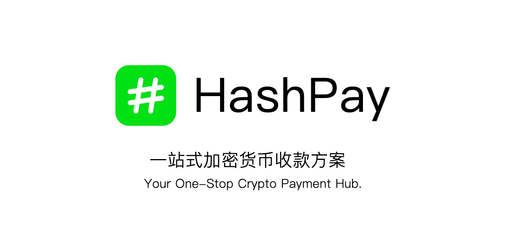
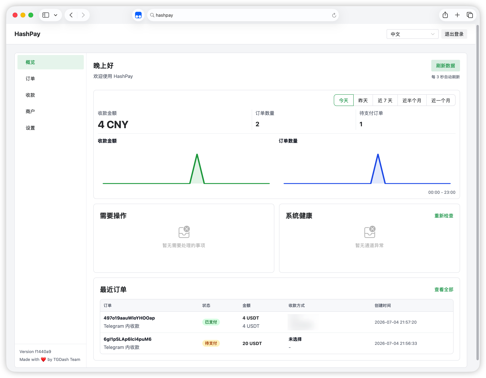
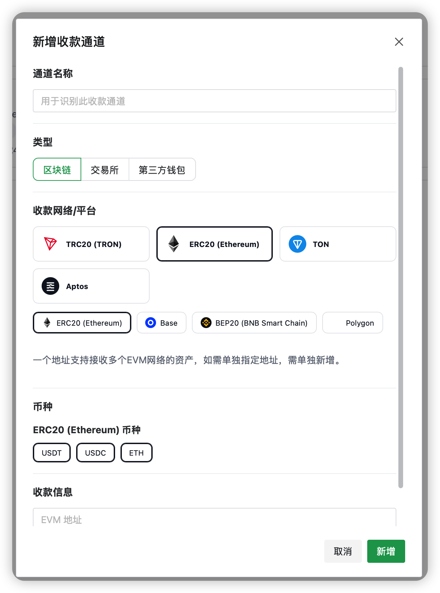
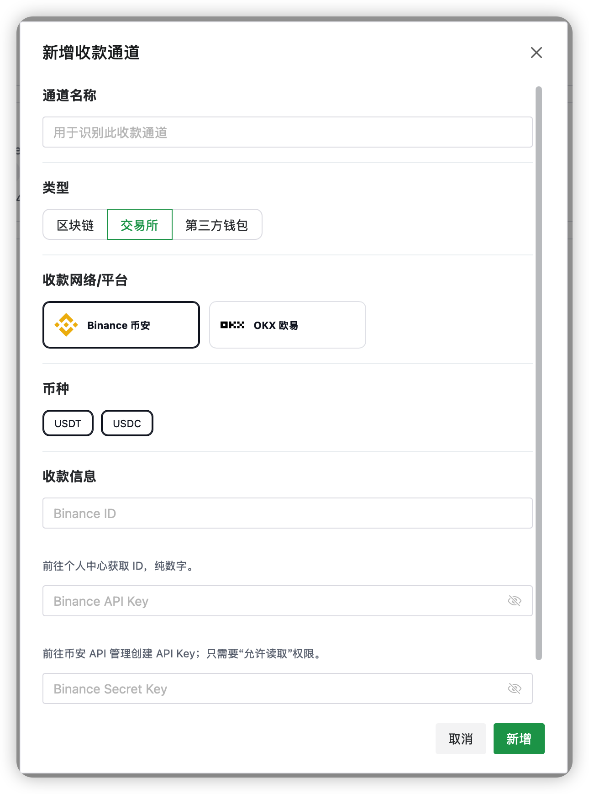
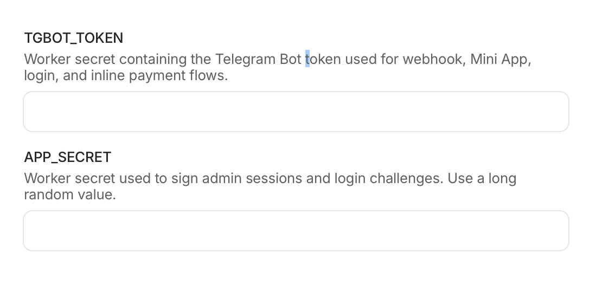

<p align="center">
  
</p>

<h1 align="center">HashPay</h1>

<p align="center">
  运行在 Cloudflare Workers 上的加密货币收款网关
</p>

<p align="center">
  
  
  
  
  
</p>

<p align="center">
  <a href="https://deploy.workers.cloudflare.com/?url=https://github.com/tgdash/HashPay">
    
  </a>
</p>

<!-- dash-content-start -->

## 🤔 这是什么

HashPay 是一款运行在 Cloudflare Workers 上的加密货币收款网关。

支持多种区块链、交易所及第三方钱包收款。支持 Telegram Inline 发起收款以及 REST API 下单，轻松接入您的网站或机器人。

运行在 Cloudflare Workers 上，意味着你不需要准备服务器即可部署收款网关。

## 🚀 快速预览



### 支持支付方式/网络




| 类型 | 通道 | 支持资产 |
| --- | --- | --- |
| 链上网络 | TRON / TRC20 | USDT、TRX |
| 链上网络 | Ethereum / ERC20 | USDT、USDC、ETH |
| 链上网络 | Base | USDT、USDC、ETH |
| 链上网络 | BNB Smart Chain / BEP20 | USDT、USDC、BNB |
| 链上网络 | Polygon | USDT、USDC、MATIC |
| 链上网络 | TON | USDT、GRAM |
| 链上网络 | Aptos | USDT、USDC |
| 交易所 | Binance Pay | USDT、USDC |
| 交易所 | OKX | USDT、USDC |
| 钱包 | OKPay | USDT、TRX |


### 典型使用场景

| 场景 | 用法 |
| --- | --- |
| 网站 / 网店 | 通过商户 API 创建订单，引导用户打开收银台付款 |
| Telegram 私域收款 | 管理员通过 inline query 发起收款 |
| 动态收款码 | 用户打开固定入口后自行选择网络和资产完成付款 |
| 交易所内部转账 | 使用 Binance Pay / OKX API 读取收款流水并匹配订单 |

## 🧩 技术栈

| 模块 | 技术 |
| --- | --- |
| Runtime | Cloudflare Workers |
| API | Hono |
| 前端 | Vue 3、Vue Router、Naive UI、Vite、SCSS |
| 数据库 | Cloudflare D1 |
| 静态资源 | Cloudflare Worker Assets |
| 队列 | Cloudflare Queues |
| 定时任务 | Cloudflare Cron Triggers |
| Telegram | grammY + Telegram Bot API |
| 测试 | Vitest |

<!-- dash-content-end -->

## ⚡ 极速开始



完成配置：

| 字段 | 获取方法 |
| --- | --- |
| `TGBOT_TOKEN` | Telegram Bot Token |
| `APP_SECRET` | Session、PIN 登录 challenge 等服务端签名用途，必须使用足够长的随机值 |

`wrangler.jsonc` 中声明的 Cloudflare 资源：

| Binding | 资源 |
| --- | --- |
| `ASSETS` | `dist` 目录构建出的前端资源 |
| `DB` | D1 数据库 `hashpay` |
| `QUEUE_NOTIFY` | 商户回调通知队列 `hashpay-notify` |

生产环境可以显式应用 D1 迁移：

```sh
npm run db:migrate:remote
```

## 🛠 初始化流程

1. 部署 Worker，并确认 `TGBOT_TOKEN`、`APP_SECRET` 已配置。
2. 访问 `https://你的域名/setup`。
3. 提交公网 HTTPS 域名，系统会配置 Telegram webhook。
4. 使用管理员 Telegram 账号向 Bot 发送任意消息完成绑定。
5. 返回初始化页面确认完成状态。
6. 进入后台并通过 Telegram Mini App 或 PIN 登录后，添加收款通道即可开始使用。

管理员绑定时会写入默认系统设置、默认 Banner，并同步一次汇率；写入 `admin_id` 后实例即视为已安装。
安装完成后再次提交 `/api/admin/setup` 会返回已初始化错误，不再重复执行初始化流程。

## 💻 本地开发

环境要求：

- Node.js 20+
- npm
- Wrangler

安装依赖：

```sh
npm install
```

创建本地环境变量：

```sh
cp .dev.vars.example .dev.vars
```

填写 `.dev.vars`：

```text
TGBOT_TOKEN=
APP_SECRET=
```

启动 Vite 开发服务：

```sh
npm run dev
```

默认访问地址为 `http://localhost:8183`。

单独启动 Worker runtime：

```sh
npm run dev:worker
```

默认 Worker 端口为 `8787`。

本地应用 D1 迁移：

```sh
npm run db:migrate:local
```

常用检查：

```sh
npm run check
npm run test
npm run build
npm run deploy:dry
```

## 🔐 商户接入

后台新增商户后，系统会生成 RSA 密钥对：

- 公钥保存在 HashPay，用于验证商户请求签名，并加密 HashPay 的 callback 通知。
- 私钥只在创建或轮换时返回一次，由商户系统自行保存，用于请求签名和解密 callback。

### 创建订单

```http
POST /api/merchant/new
X-Merchant-Id: <merchant-id>
X-Timestamp: <unix-seconds>
X-Signature: <base64-rsa-sha256-signature>
Content-Type: application/json

{
  "merchantNo": "ORDER-10001",
  "amount": 1,
  "currency": "USD",
  "description": "Test order",
  "callback": "https://merchant.example.com/callback",
  "return_url": "https://merchant.example.com/return"
}
```

签名原文：

```text
METHOD
pathname + search
timestamp
body
```

例如：

```text
POST
/api/merchant/new
1782000000
{"merchantNo":"ORDER-10001","amount":1,"currency":"USD"}
```

响应包含：

| 字段 | 说明 |
| --- | --- |
| `checkoutUrl` | 用户访问的收银台地址 |
| `order` | 订单摘要 |
| `reused` | 同一商户、同一 `merchantNo` 重复请求时为 `true` |

### 回调加密

HashPay 投递 callback 时会附带以下请求头：

| Header | 说明 |
| --- | --- |
| `X-HashPay-Merchant` | 商户 ID |
| `X-HashPay-Timestamp` | 投递时的 Unix 秒时间戳 |
| `X-HashPay-Encryption` | 固定为 `RSA-OAEP-256+A256GCM` |

请求体是加密信封：

```json
{
  "alg": "RSA-OAEP-256+A256GCM",
  "key": "<base64-rsa-encrypted-aes-key>",
  "iv": "<base64-aes-gcm-iv>",
  "data": "<base64-aes-gcm-ciphertext>"
}
```

商户系统使用创建/轮换商户时返回的私钥解密 `key`，再用解出的 AES key 解密 `data`。解密后的 JSON 结构为：

```json
{
  "timestamp": 1782000000,
  "payload": {
    "orderId": "...",
    "merchantNo": "...",
    "amount": 1,
    "currency": "USD",
    "status": "paid",
    "payment": {}
  }
}
```

商户系统应校验解密后的 `timestamp` 与请求头时间戳一致，并限制可接受的时间窗口。

### 查询订单

```http
GET /api/order/:orderId
X-Merchant-Id: <merchant-id>
X-Timestamp: <unix-seconds>
X-Signature: <base64-rsa-sha256-signature>
```

## ⏱ 定时任务和通知

`src/index.ts` 导出 `scheduled()` 和 `queue()`：

| 任务 | 行为 |
| --- | --- |
| Cron | 每分钟执行一次任务 |
| 汇率同步 | 每个整点同步一次汇率 |
| 订单过期 | 过期未支付订单自动标记为 `expired` |
| 自动查账 | 待检查订单进入服务端 provider 查账流程 |
| 通知入队 | 到期商户通知写入 `QUEUE_NOTIFY` |
| Queue 消费 | 投递商户 callback，失败后按重试策略继续投递 |

本地测试 Cron：

```sh
npm run cron:test
curl "http://localhost:8787/cdn-cgi/handler/scheduled?format=json"
```

## 🔄 更新实例

通过本仓库创建的实例可以在 GitHub Actions 中运行 **Update HashPay** workflow，从上游 `tgdash/HashPay` 同步应用代码。

更新流程会保留当前实例的 `wrangler.jsonc` 部署资源配置，但自定义代码可能被覆盖。

## 📁 目录结构

```text
src/index.ts                         Worker 入口
src/server/http/                     Hono 应用和 API 路由
src/server/services/                 后端业务服务
src/server/payments/                 支付通道模型和查账 provider
src/server/db/                       D1 helper 和迁移
src/shared/                          前后端共享类型、支付定义和 i18n
src/app/                             Vue 管理后台和收银台
test/                                Vitest 测试
wrangler.jsonc                       Cloudflare Workers 配置
```

## 🛡 安全注意

- 不要提交 `.dev.vars`、Bot Token、`APP_SECRET`、商户私钥或交易所 API 密钥。
- 交易所 API Key 只需要读取权限，不要开启提现权限。
- 商户私钥由商户系统保存，HashPay 只保存公钥。
- 生产环境应使用 HTTPS 域名完成初始化和 Telegram webhook 配置。

## 🙌 License

HashPay 使用 Apache-2.0 协议。
